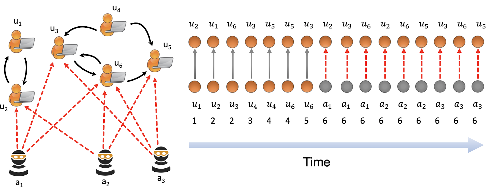

# MIDAS

<p>
  <a href="https://aaai.org/Conferences/AAAI-20/">
    
  </a>
  <a href="https://arxiv.org/pdf/2009.08452.pdf"></a>
  <a href="https://www.comp.nus.edu.sg/~sbhatia/assets/pdf/midasslides.pdf">
      
  </a>
  <a href="https://youtu.be/Bd4PyLCHrto">
    
  </a>
  <a href="https://www.youtube.com/watch?v=DPmN-uPW8qU"> 
    
  </a>
  <a href="https://github.com/bhatiasiddharth/MIDAS/blob/master/LICENSE">
    
  </a>
</p>

C++ implementation of

- [Real-time Streaming Anomaly Detection in Dynamic Graphs](https://arxiv.org/pdf/2009.08452.pdf). *Siddharth Bhatia, Rui Liu, Bryan Hooi, Minji Yoon, Kijung Shin, Christos Faloutsos*. (Under Review)
- [MIDAS: Microcluster-Based Detector of Anomalies in Edge Streams](https://arxiv.org/pdf/1911.04464.pdf). *Siddharth Bhatia, Bryan Hooi, Minji Yoon, Kijung Shin, Christos Faloutsos*. AAAI 2020.

The old implementation is in another branch `OldImplementation`, it should be considered as being archived and will hardly receive feature updates.



## Table of Contents

<!-- START doctoc generated TOC please keep comment here to allow auto update -->
<!-- DON'T EDIT THIS SECTION, INSTEAD RE-RUN doctoc TO UPDATE -->


- [Features](#features)
- [Demo](#demo)
- [Customization](#customization)
- [Other Files](#other-files)
- [In Other Languages](#in-other-languages)
- [Online Coverage](#online-coverage)
- [Citation](#citation)

<!-- END doctoc generated TOC please keep comment here to allow auto update -->

## Features

- Finds Anomalies in Dynamic/Time-Evolving Graph: (Intrusion Detection, Fake Ratings, Financial Fraud)
- Detects Microcluster Anomalies (suddenly arriving groups of suspiciously similar edges e.g. DoS attack)
- Theoretical Guarantees on False Positive Probability
- Constant Memory (independent of graph size)
- Constant Update Time (real-time anomaly detection to minimize harm)
- Up to 55% more accurate and 929 times faster than the state of the art approaches
- Experiments are performed using the following datasets: 
  - [DARPA](https://www.ll.mit.edu/r-d/datasets/1998-darpa-intrusion-detection-evaluation-dataset)
  - [TwitterWorldCup2014](http://odds.cs.stonybrook.edu/twitterworldcup2014-dataset)
  - [TwitterSecurity](http://odds.cs.stonybrook.edu/twittersecurity-dataset)

## Demo

If you use Windows:

1. Open a Visual Studio developer command prompt, we want their toolchain
1. `cd` to the project root `MIDAS/`
1. `cmake -DCMAKE_BUILD_TYPE=Release -GNinja -S . -B build/release`
1. `cmake --build build/release --target Demo`
1. `cd` to `MIDAS/build/release/`
1. `.\Demo.exe`

If you use Linux/macOS:

1. Open a terminal
1. `cd` to the project root `MIDAS/`
1. `cmake -DCMAKE_BUILD_TYPE=Release -S . -B build/release`
1. `cmake --build build/release --target Demo`
1. `cd` to `MIDAS/build/release/`
1. `./Demo`

The demo runs on `MIDAS/data/DARPA/darpa_processed.csv`, which has 4.5M records, with the filtering core (MIDAS-F).

The scores will be exported to `MIDAS/temp/Score.txt`, higher means more anomalous.

All file paths are absolute and "hardcoded" by CMake, but it's suggested NOT to run by double clicking on the executable file.

### Requirements

Core
- C++11
- C++ standard libraries

Demo
- Python 3 (`MIDAS/util/EvaluateScore.py`)
    - `pandas`: I/O 
    - `scikit-learn`: Compute ROC-AUC

Experiment
- (Optional) Intel TBB: Parallelization
- (Optional) OpenMP: Parallelization

Other python utility scripts
- Python 3
    - `pandas`
    - `scikit-learn`

## Customization

### Different CMS Size / Decay Factor / Threshold

Those are arguments of cores' constructors, which are at `MIDAS/example/Demo.cpp:67-69`.

### Switch Cores

Cores are instantiated at `MIDAS/example/Demo.cpp:67-69`, uncomment the chosen one.

### Custom Dataset + `Demo.cpp`

You need to prepare three files:

- Meta file
  - Only includes an integer `N`, the number of records in the dataset
  - Use its path for `pathMeta`
  - E.g. `MIDAS/data/DARPA/darpa_shape.txt`
- Data file
  - A header-less csv format file of shape `[N,3]`
  - Columns are sources, destinations, timestamps
  - Use its path for `pathData`
  - E.g. `MIDAS/data/DARPA/darpa_processed.csv`
- Label file
  - A header-less csv format file of shape `[N,1]`
  - The corresponding label for data records
    - 0 means normal record
    - 1 means anomalous record
  - Use its path for `pathGroundTruth`
  - E.g. `MIDAS/data/DARPA/darpa_ground_truth.csv`

### Custom Dataset + Custom Runner

1. Include the header `MIDAS/src/NormalCore.hpp`, `MIDAS/src/RelationalCore.hpp` or `MIDAS/src/FilteringCore.hpp`
1. Instantiate cores with required parameters
1. Call `operator()` on individual data records, it returns the anomaly score for the input record

## Other Files

### `example/`

#### `Experiment.cpp`

The code we used for experiments.   
It will try to use Intel TBB or OpenMP for parallelization.  
You should comment all but only one runner function call in the `main()` as most results are exported to `MIDAS/temp/Experiiment.csv` together with many intermediate files.

#### `Reproducible.cpp`

Similar to `Demo.cpp`, but with all random parameters hardcoded and always produce the same result.  
It's for other developers and us to test if the implementation in other languages can produce acceptable results.  

### `util/`

`DeleteTempFile.py`, `EvaluateScore.py` and `ReproduceROC.py` will show their usage and a short description when executed without any argument.

#### `PreprocessData.py`

The code to process the raw dataset into an easy-to-read format.
Datasets are always assumed to be in a folder in `MIDAS/data/`.    
It can process the following dataset(s)

- `DARPA/darpa_original.csv` -> `DARPA/darpa_processed.csv`, `DARPA/darpa_ground_truth.csv`, `DARPA/darpa_shape.txt`

## In Other Languages

1. Python: [Rui Liu's MIDAS.Python](https://github.com/liurui39660/MIDAS.Python), [Ritesh Kumar's pyMIDAS](https://github.com/ritesh99rakesh/pyMIDAS)
1. Golang: [Steve Tan's midas](https://github.com/steve0hh/midas)
1. Ruby: [Andrew Kane's midas](https://github.com/ankane/midas)
1. Rust: [Scott Steele's midas_rs](https://github.com/scooter-dangle/midas_rs)
1. R: [Tobias Heidler's MIDASwrappeR](https://github.com/pteridin/MIDASwrappeR)
1. Java: [Joshua Tokle's MIDAS-Java](https://github.com/jotok/MIDAS-Java)
1. Julia: [Ashrya Agrawal's MIDAS.jl](https://github.com/ashryaagr/MIDAS.jl)

## Online Coverage

1. [ACM TechNews](https://technews.acm.org/archives.cfm?fo=2020-05-may/may-06-2020.html)
1. [AIhub](https://aihub.org/2020/05/01/interview-with-siddharth-bhatia-a-new-approach-for-anomaly-detection/)
1. [Hacker News](https://news.ycombinator.com/item?id=22802604)
1. [KDnuggets](https://www.kdnuggets.com/2020/04/midas-new-baseline-anomaly-detection-graphs.html)
1. [Microsoft](https://techcommunity.microsoft.com/t5/azure-sentinel/announcing-the-azure-sentinel-hackathon-winners/ba-p/1548240)
1. [Towards Data Science](https://towardsdatascience.com/controlling-fake-news-using-graphs-and-statistics-31ed116a986f)

## Citation

If you use this code for your research, please consider citing our arXiv preprint

```bibtex
@misc{bhatia2020realtime,
    title={Real-Time Streaming Anomaly Detection in Dynamic Graphs},
    author={Siddharth Bhatia and Rui Liu and Bryan Hooi and Minji Yoon and Kijung Shin and Christos Faloutsos},
    year={2020},
    eprint={2009.08452},
    archivePrefix={arXiv},
    primaryClass={cs.LG}
}

```

or our AAAI paper


```bibtex
@inproceedings{bhatia2020midas,
    title="MIDAS: Microcluster-Based Detector of Anomalies in Edge Streams",
    author="Siddharth {Bhatia} and Bryan {Hooi} and Minji {Yoon} and Kijung {Shin} and Christos {Faloutsos}",
    booktitle="AAAI 2020 : The Thirty-Fourth AAAI Conference on Artificial Intelligence",
    year="2020"
}
```
